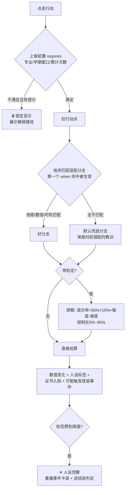
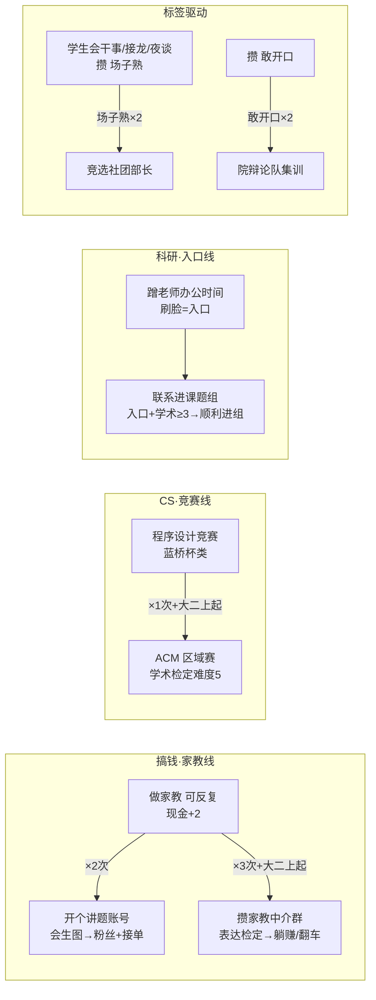
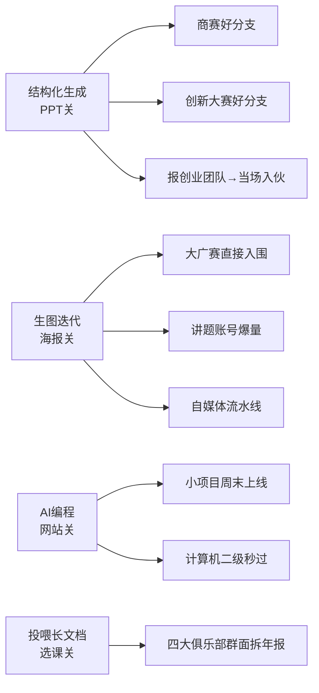

# 09 · 行动板全图（自动生成 + 设计说明）

> 本文档的行动明细由 `content/sim/actions.json` 脚本生成，与游戏内数据严格一致。
> 重新生成：改完 JSON 后跑 `python3 scripts/gen-action-map.py`（脚本正文见仓库）。

## 一、结算逻辑：每个行动是怎么算结果的

行动没有写死的"好结果/坏结果"。点下去后引擎按下图走：

**设计原则**（对应你的要求）：行动本身无好坏，结果只看三件事——**专业是否对口**（majors 过滤）、**时机是否合适**（semesterMin/Max 分支）、**积累是否到位**（能力/数值/累计次数分支）。

## 二、累进链：跨学期的成长路线

## 三、主线 AI 能力如何反哺行动板

没学技能去做同一件事，走的是默认兜底分支：初筛被刷、被问「你会什么」、产能跟不上——**投入了但没有好结果**，因为不适合，不是因为事情不好。

## 四、行动组合 → 人生走向（三条示例路线）

| 路线 | 典型行动组合 | 攒出的标签 | 数值形状 | 倾向的结局 |
|---|---|---|---|---|
| 卷王学术流 | 刷绩点×N + 办公时间→课题组 + 数模/ACM + 四六级 | 卷王✦ | 学术、作品双高 | 学术/保研向身份卡 |
| 搞钱实干流 | 家教×3→讲题账号→中介群 + 摆摊 + 自媒体 | 会过日子✦ 折腾家✦ | 现金、作品高 | 创业/自由职业向 |
| 社交表达流 | 学生会 + 接龙 + 竞选部长 + 辩论/模联 + 商赛 | 场子熟✦ 敢开口✦ | 表达高 | 组织/表达向 |

（结局判定的完整扩容在 P2 做：标签画像 × 四轴形状 × flag 达成度 × 关键链完成度 → 20± 张身份卡）

## 五、全部 40 项行动明细（自动生成）

### 学习拓展（8 项）

**📚 泡图书馆刷绩点**（1点）· 全专业全学期
> 三楼靠窗的位置，和一摞练习册。
> - 卷王×3 → 学术+2
> - （默认兜底） → 学术+2 精力-1｜人设:卷王+1

**📝 报名四六级**（1点）· 前置：大一下起
> 逃不掉的，早晚都要考。
> - 学术≥4 → 学术+1｜📁四六级证书
> - （默认兜底） → 检定学术(难度3)：成 学术+1｜📁四六级证书｜败 精力-1｜人设:卷王+1

**🖥️ 考计算机二级**（1点）· 前置：大一下起
> 简历上「熟练使用 Office」的官方盖章。
> - 会「AI 编程」 → 学术+1｜📁计算机二级证书
> - （默认兜底） → 检定学术(难度2)：成 学术+1｜📁计算机二级证书｜败 精力-1

**📜 跟风考热门证书**（1点）· 全专业全学期
> 群里都在转「大学必考的 X 个证」，你也心动了。
> - （无条件） → 检定学术(难度3)：成 学术+1 现金-1 精力-1｜败 现金-1 精力-1

**🍎 考教师资格证**（1点）· 前置：大二上起
> 「以后万一想当老师呢」——很多人的保底选项。
> - 表达≥3 → 检定学术(难度3)：成 学术+1｜人设:卷王+1｜📁教师资格证｜败 精力-1
> - （默认兜底） → 检定学术(难度4)：成 学术+1 精力-1｜📁教师资格证｜败 精力-1

**🎓 报个辅修**（1点）· 前置：大一下起 + 学术≥3｜全程一次
> 周末上课，用两年换第二个专业的入场券。
> - （无条件） → 学术+2 精力-2｜人设:卷王+1

**✈️ 申请交换 / 暑期学校**（1点）· 前置：大二上起｜全程一次
> 换一所学校、换一个城市读一学期。
> - 学术≥4、现金≥2 → 学术+1 作品+1 精力+1 现金-2｜📁交换学习证明
> - （默认兜底） → 精力-1｜人设:卷王+1

**📕 法考刷题**（1点）· 专业：法学｜前置：大三上起
> 毕业年才能考，但没人敢等到毕业年才学。
> - （无条件） → 学术+2 精力-1｜人设:卷王+1

### 科研与竞赛（14 项）

**🔬 联系老师进课题组**（1点）· 前置：大一下起
> 给专业课老师发邮件，问能不能进组打杂。
> - 限大一下前 → 精力-1
> - 学术≥3 + 蹭老师的办公时间×1 → 学术+2｜人设:卷王+1
> - 学术≥4 → 学术+2｜人设:卷王+1
> - （默认兜底） → 精力-1｜人设:卷王+1

**🧮 数学建模竞赛**（1点）· 专业：计算机类/工科/理科｜前置：大一下起
> 三人一队，三天三夜，一篇论文定胜负。
> - 学术≥4 → 检定学术(难度4)：成 作品+2 学术+1｜人设:卷王+1｜📁数学建模省二等奖｜败 学术+1 精力-2｜人设:卷王+1
> - （默认兜底） → 学术+1 精力-1

**💻 程序设计竞赛**（1点）· 专业：计算机类｜前置：大一下起
> 蓝桥杯这类，一个人、一台电脑、四个小时。
> - （无条件） → 检定学术(难度3)：成 作品+2｜📁程序设计竞赛省奖｜败 学术+1 精力-1｜人设:卷王+1

**📊 商赛（案例分析大赛）**（1点）· 专业：商科｜前置：大一下起
> 四大和咨询公司办的那种，组队给企业出方案。
> - 会「AI 做 PPT」 → 检定表达(难度3)：成 作品+2 表达+1｜📁商赛晋级证明｜败 表达+1 精力-1
> - （默认兜底） → 检定表达(难度5)：成 作品+1 表达+1 精力-2｜败 精力-1

**⚖️ 模拟法庭**（1点）· 专业：法学｜前置：大一下起
> 抽一个真实案例，站上法庭攻防。
> - （无条件） → 检定表达(难度3)：成 表达+2 作品+1｜人设:敢开口+1｜败 表达+1 精力-1

**🩺 临床技能竞赛**（1点）· 专业：医学｜前置：大二下起 + 学术≥3
> 缝合、查体、急救，练的全是手上功夫。
> - （无条件） → 检定学术(难度4)：成 作品+2 学术+1｜📁临床技能竞赛奖｜败 学术+1 精力-1｜人设:卷王+1

**🎨 大广赛**（1点）· 专业：设计/人文/商科｜前置：大一下起
> 给真实品牌命题做广告作品。
> - 会「AI 生图」 → 作品+2｜📁大广赛入围
> - （默认兜底） → 检定作品(难度3)：成 作品+2｜📁大广赛入围｜败 作品+1 精力-1

**🚪 蹭老师的办公时间**（1点）· 全专业全学期
> 带着问题去，哪怕问题很笨。
> - （无条件） → 学术+1 表达+1｜人设:敢开口+1

**🧱 做一个自己的小项目**（1点）· 专业：计算机类/工科/理科｜前置：大一下起
> 一个工具、一个网页、一个开源仓库。
> - 会「AI 编程」 → 作品+2｜人设:折腾家+1
> - （默认兜底） → 检定学术(难度3)：成 作品+1 学术+1｜人设:折腾家+1｜败 精力-1｜人设:折腾家+1

**🏆 ACM 程序设计竞赛**（1点）· 专业：计算机类｜前置：大二上起 + 程序设计竞赛×1
> 算法竞赛的天花板，三人一队五小时。
> - （无条件） → 检定学术(难度5)：成 作品+2 学术+1｜人设:卷王+1｜📁ACM 区域赛铜奖｜败 学术+1 精力-2｜人设:卷王+1

**🔌 电子设计竞赛**（1点）· 专业：工科｜前置：大二上起 + 学术≥3
> 四天三夜，从元件到成品焊出一台机器。
> - （无条件） → 检定学术(难度4)：成 作品+2 学术+1｜人设:卷王+1｜📁电子设计竞赛省奖｜败 学术+1 精力-2｜人设:卷王+1

**💡 大学生创新大赛**（1点）· 前置：大二上起
> 拉一支跨专业队伍，把想法包装成项目。
> - 作品≥3 + 会「AI 做 PPT+AI 生图」 → 检定表达(难度4)：成 作品+3 表达+1｜人设:折腾家+1｜📁创新大赛校赛金奖｜败 作品+2 精力-1
> - （默认兜底） → 精力-1 作品+1

**🌐 模拟联合国**（1点）· 专业：人文/法学/商科｜前置：大一下起
> 穿正装、举国家牌，为一个立场辩三天。
> - （无条件） → 检定表达(难度3)：成 表达+2 作品+1｜人设:敢开口+1、场子熟+1｜败 表达+1 精力-1

**🎙️ 院辩论队集训**（1点）· 前置：大一下起 + 敢开口×2
> 一周两练，输赢都在赛场上见。
> - （无条件） → 检定表达(难度4)：成 表达+2｜人设:敢开口+1｜败 表达+1 精力-1｜人设:敢开口+1

### 社会实践（8 项）

**🎪 竞选社团部长**（1点）· 前置：大一下起 + 场子熟×2
> 干了一年干事，该往上走一步了？
> - （无条件） → 检定表达(难度3)：成 表达+2｜人设:敢开口+1、场子熟+1｜败 精力-1｜人设:敢开口+1

**🤝 周末支教**（1点）· 全专业全学期
> 城郊小学缺人讲课，来回三小时。
> - （无条件） → 表达+1 精力-1｜人设:老好人+1

**🏢 四大俱乐部 / PT**（1点）· 专业：商科｜前置：大二下起
> 会计师事务所的校园人才池，学期制打杂。
> - 表达≥3 + 会「AI 读长文档」 → 表达+1 作品+1｜人设:场子熟+1｜📁四大俱乐部成员
> - （默认兜底） → 检定表达(难度4)：成 表达+1｜人设:场子熟+1｜败 精力-1

**🏥 跟诊见习**（1点）· 专业：医学｜前置：大二上起
> 跟着带教老师查房，站一上午。
> - （无条件） → 学术+2 精力-1｜人设:卷王+1

**🏛️ 学生会干事**（1点）· 仅限：y1s1、y1s2
> 搬水、布场、写推送，事无巨细。
> - （无条件） → 表达+1 精力-1｜人设:场子熟+1、老好人+1

**🌾 三下乡暑期实践**（1点）· 仅限：y1s2、y2s2
> 组队去乡镇做十天调研或支教。
> - 老好人×2 → 表达+1 作品+1 精力-1｜人设:老好人+1｜📁三下乡优秀团队
> - （默认兜底） → 表达+1 精力-1｜人设:老好人+1、场子熟+1

**📮 海投实习简历**（1点）· 前置：限大二下前
> 越早实习越好？先投五十份试试水。
> - 作品≥4 → 作品+1 现金+1
> - （默认兜底） → 精力-1

**💼 暑期实习（黄金窗口）**（1点）· 仅限：y3s2
> 大三暑假的实习，是秋招的入场券。
> - 作品≥5 → 作品+2 现金+2｜📁暑期实习证明
> - （默认兜底） → 检定表达(难度4)：成 作品+1 现金+1｜📁暑期实习证明｜败 精力-1

### 搞钱（6 项）

**🧑‍🏫 做家教**（1点）· 全专业全学期
> 每周两次，教一个初中生数学。
> - （无条件） → 现金+2 精力-1｜人设:会过日子+1

**📱 开个讲题账号**（1点）· 前置：做家教×2
> 把家教讲过的题做成短视频发出去。
> - 会「AI 生图」 → 作品+2 现金+1｜人设:折腾家+1
> - （默认兜底） → 检定表达(难度3)：成 作品+1 现金+1｜人设:折腾家+1｜败 精力-1｜人设:折腾家+1

**🧩 攒一个家教中介群**（1点）· 前置：大二上起 + 做家教×3
> 你认识缺家教的家长，也认识缺钱的同学。
> - （无条件） → 检定表达(难度4)：成 现金+3 作品+1｜人设:折腾家+1、会过日子+1｜败 现金-1 精力-1｜人设:折腾家+1

**🚀 报学长的创业团队**（1点）· 全专业全学期
> 群里看到招人：做校园周边生意，缺人手。
> - 限大一上前 → 精力-1
> - 会「AI 做 PPT」 → 作品+2 表达+1｜人设:折腾家+1
> - （默认兜底） → 检定表达(难度4)：成 作品+1 精力-1｜人设:敢开口+1｜败 精力-1

**📹 认真起一个号**（1点）· 前置：大一下起
> 选一个赛道，把它当产品做。
> - 会「AI 生图+AI 做 PPT」 → 检定作品(难度3)：成 作品+2 现金+1｜人设:折腾家+1｜败 作品+1 精力-1｜人设:折腾家+1
> - （默认兜底） → 作品+1 精力-1｜人设:折腾家+1

**🏮 夜市摆摊**（1点）· 全专业全学期
> 进点货，支个摊，练练胆。
> - （无条件） → 检定表达(难度3)：成 现金+2 表达+1｜人设:会过日子+1、敢开口+1｜败 现金-1 精力-1｜人设:会过日子+1

### 生活（4 项）

**🛏️ 什么都不做**（0点）· 全专业全学期
> 睡觉、看电影、发呆。没有任何产出。
> - （无条件） → 精力+2

**🚗 假期考驾照**（1点）· 仅限：y1s2、y2s1、y2s2｜全程一次
> 趁假期把这事了了，工作后就没这时间了。
> - （无条件） → 现金-1 精力-1｜📁驾驶证

**🎒 出去走一趟**（1点）· 全专业全学期
> 特种兵式也好，慢慢晃也好。
> - 现金≥3 → 精力+2 作品+1
> - （默认兜底） → 精力+1 作品+1 现金-1｜人设:会过日子+1

**🏃 报名校运会**（1点）· 全专业全学期
> 给院里凑个人头，或者认真跑一回。
> - 特质:athlete → 表达+1 精力+1｜人设:场子熟+1
> - （默认兜底） → 精力+1｜人设:场子熟+1
